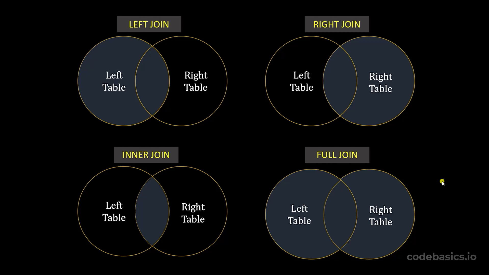

# Joins en SQL



## INNER JOIN (JOIN por defecto)

```sql
SELECT
    t1.id, columna1, columna2, columna3, columna4
FROM nombrebd.tabla1 t1 INNER JOIN nombrebd.tabla2 t2
ON t1.id=t2.id
```

```sql
SELECT
    t1.id, columna1, columna2, columna3, columna4
FROM nombrebd.tabla1 t1 JOIN nombrebd.tabla2 t2
ON t1.id=t2.id
```

## OUTER JOINS

### LEFT JOIN / LEFT OUTER JOIN
```sql
SELECT
    t1.id, columna1, columna2, columna3, columna4
FROM nombrebd.tabla1 t1 LEFT JOIN nombrebd.tabla2 t2
ON t1.id=t2.id
```


### RIGHT JOIN / RIGHT OUTER JOIN
```sql
SELECT
    t2.id, columna1, columna2, columna3, columna4
FROM nombrebd.tabla1 t1 RIGHT JOIN nombrebd.tabla2 t2
ON t1.id=t2.id
```

### FULL JOIN

```sql
SELECT
    t1.id, columna1, columna2, columna3, columna4
FROM nombrebd.tabla1 t1 LEFT JOIN nombrebd.tabla2 t2
ON t1.id=t2.id

UNION

SELECT
    t2.id, columna1, columna2, columna3, columna4
FROM nombrebd.tabla1 t1 RIGHT JOIN nombrebd.tabla2 t2
ON t1.id=t2.id
```

Es la unión de `LEFT JOIN` y `RIGHT JOIN`.

## USING

```sql
SELECT
    id, columna1, columna2, columna3, columna4
FROM nombrebd.tabla1 LEFT JOIN nombrebd.tabla2
USING (id)
```

Se puede usar esta forma de `JOIN` cuando las tablas a unirse tienen el mismo nombre para la columna que se usará para el `JOIN`.

## JOIN con más de un columna

```sql
SELECT
    columna1, columna2, columna3, columna4
FROM nombrebd.tabla1 t1 JOIN nombrebd.tabla2 t2
ON t1.id1=t2.id1 AND t1.id2=t2.id2
```

```sql
SELECT
    columna1, columna2, columna3, columna4
FROM nombrebd.tabla1 JOIN nombrebd.tabla2
USING (id1, id2)
```

## CROSS JOIN / CARTESIAN JOIN

$$
A \text{ CROSS JOIN } B = \{ (x,y)\:|\: x\in A \wedge y\in B \}
$$

```sql
SELECT *
FROM nombrebd.tabla1 CROSS JOIN nombrebd.tabla2;
```

Ejemplo:

```sql
select
	*,
    concat(name,' - ', variant_name) as full_name,
    (price + variant_price) as full_price
from food_db.items cross join food_db.variants;
```

## Ejemplos de JOINs

```sql
use moviesdb;
select
	movie_id, title, budget, revenue, currency, unit,
    case
		when unit="Billions" then round((revenue - budget)*1000,2)
        when unit="Millions" then round((revenue - budget),2)
        when unit="Thousands" then round((revenue - budget)/1000,2)
    end as profit_mill
from movies m left join financials f using (movie_id)
order by profit_mill desc
limit 10;
```

```sql
use moveisdb;
select
	name,
    group_concat(title separator ", ") as movies,
    count(title) as movie_count
from
movies m join movie_actor ma using (movie_id)
join actors a using (actor_id)
group by actor_id
order by movie_count desc;
```

```sql
use moviesdb;
select
	title, revenue, currency, unit,
    case
		when unit="Billions" then round(revenue*1000,2)
        else round(revenue,2)
    end as revenue_mill_INR
from movies m
join languages l using (language_id)
join financials f using(movie_id)
where l.name="Hindi"
order by revenue_mill_INR desc;
```

```sql
SELECT 
	title, revenue, currency, unit, 
	CASE 
		WHEN unit="Thousands" THEN ROUND(revenue/1000,2)
		WHEN unit="Billions" THEN ROUND(revenue*1000,2)
		ELSE revenue 
	END as revenue_mln
FROM movies m
JOIN financials f ON m.movie_id=f.movie_id
JOIN languages l ON m.language_id=l.language_id
WHERE l.name="Hindi"
ORDER BY revenue_mln DESC;
```