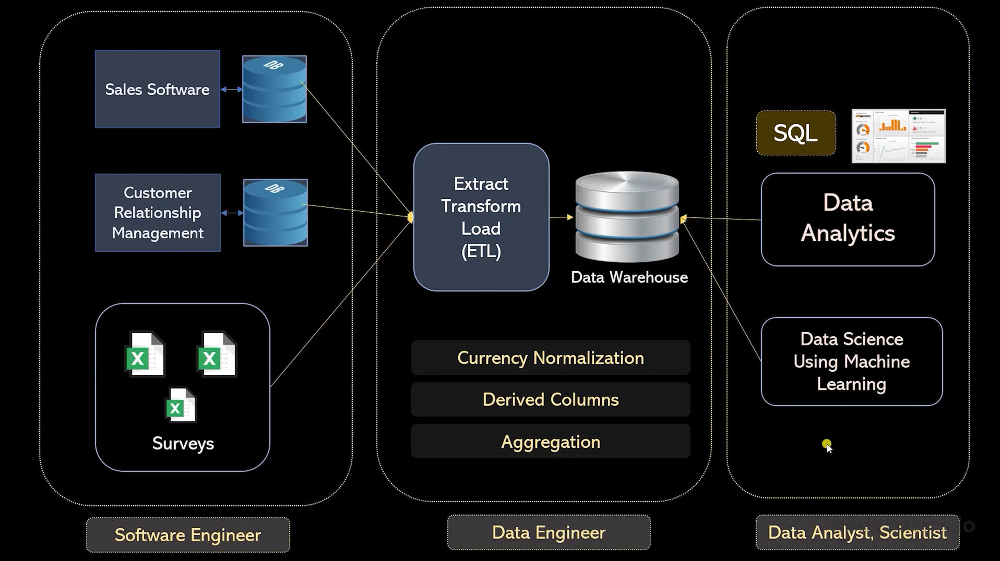

# Conceptos 

## Data warehouse

A data warehouse is a type of data management system that is designed to enable and support business intelligence (BI) activities, especially analytics. Data warehouses are solely intended to perform queries and analysis and often contain large amounts of historical data. The data within a data warehouse is usually derived from a wide range of sources such as application log files and transaction applications. 

## ETL

Extract, Transform, Load

## OLAP

Online Analytical Processing

## OLTP

Online Transaction Processing

## Data catalog

A Data Catalog is a collection of metadata, combined with data management and search tools, that helps analysts and other data users to find the data that they need, serves as an inventory of available data, and provides information to evaluate fitness of data for intended uses.