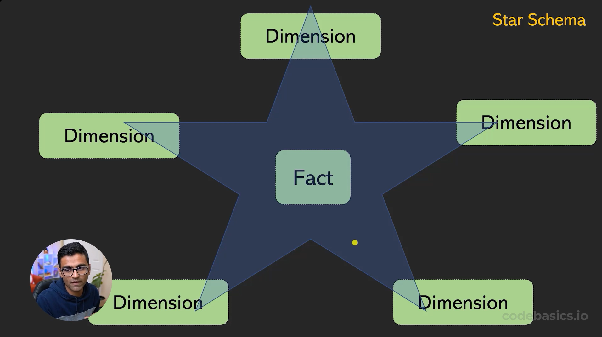
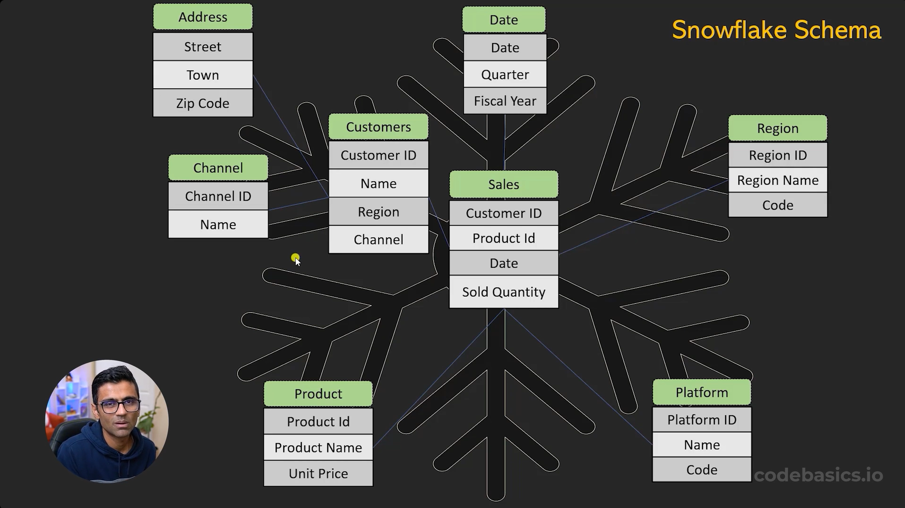

# DB

## Fact vs Dimension tables

### Fact

Eventos, transacciones. No necesariemente tienen una columna donde todos los valores son únicos

### Dimension

Atributos, características. Tienen al menos una columna donde todos los valores son únicos.

## Star vs Snowflake Schema

### Star

La tabla "Fact" está altamente **normalizada**, puesto que la información adicional se encuentra en las tablas "Dimension".

Por el contrario, las tablas "Dimension" están altamente desnomalizadas, ya que contienen toda la información relacionada a cierto atributo (por ejemplo, cliente) en una sola tabla.

### Snowflake

